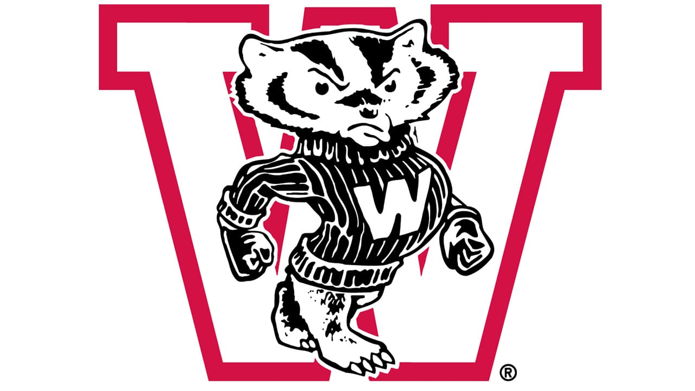

# Hi There, I'm Nick
I am working on my Masters of Science in Data Analytics from the University of Wisconsin-Madison. During my time in this short sprint, I have been able to go hands-on with many different software and analysis processes. This portfolio will detail some of the highlights from my time in Madison as well as my undergrad at Ohio University!

<table style="width: 100%; border-collapse: collapse; border: none;">
  <tr style="border: none;">
    <td align="center" style="border: none; width: 50%;">
       
      <strong>University of Wisconsin-Madison</strong> 
      <em>Graduate Studies (2025 – Present)</em>
    </td>
    <td align="center" style="border: none; width: 50%;">
       
      <strong>Ohio University</strong> 
      <em>Undergraduate (2020 – 2024)</em>
    </td>
  </tr>
</table>

# Experience
NWL Poster Project: Utilized random forests, EDA techniques, and seaborn-based visuals to identify the top metrics for describing success in the Northwoods League. Process metrics like hits or home runs, were not as crucial to success. [View the process in my repo!](https://github.com/njnameth/Northwoods-League-Player-Analysis)

Fan Intelligence Pipeline: A simulated approach to my semester long project involving a local sports team. The pipeline extracts data from a Snowflake staging area, transforms & joins four different datasets with a Google Colab script, and outputs into a full fan profile for further use in visualization. [View the process in my repo!](https://github.com/njnameth/Sports-Fan-Intelligence-Pipeline)

Healthcare Analytics Competition: Placed in a program-wide sprint to identify patient wait-time bottlenecks for a hypothetical healthcare provider. As a result of this achievement, I was selected to attend Microsoft FabCon 2026 in Atlanta.

AWS Data Pipeline Architecture: This project addresses the challenges of managing inconsistent data flows and unstructured financial records. I designed a scalable AWS-based architecture to streamline the identification of potential company acquisitions by integrating financial ratios, historical bankruptcy data, and client records into a single source of truth. [View the process in my repo!](https://github.com/njnameth/AWS-Data-Pipeline-Architecture)

Culver’s Brand Study: Directed focus groups and surveys to analyze Gen Z perceptions for Culver's. The success of this project led to the brand's adoption of our recommended qualitative research platforms. 

# Technical Toolkit
<table style="width: 100%; border: none;">
  <tr>
    <td width="50%" style="vertical-align: top; border: none;">
      <h4>📊 BI & Visualization</h4>
      <ul>
        <li><strong>Tableau & Power BI</strong> (Dashboarding)</li>
        <li><strong>Canva</strong> (Information Design)</li>
        <li><strong>Qualtrics</strong> (Survey Design)</li>
      </ul>
    </td>
    <td width="50%" style="vertical-align: top; border: none;">
      <h4>🐍 Programming & SQL</h4>
      <ul>
        <li><strong>Python</strong> (Pandas, NumPy, Seaborn)</li>
        <li><strong>R & RStudio</strong> (Statistical Analysis)</li>
        <li><strong>SQL</strong> (Snowflake, Complex Queries)</li>
      </ul>
    </td>
  </tr>
  <tr>
    <td width="50%" style="vertical-align: top; border: none;">
      <h4>🛠️ Tools & Platforms</h4>
      <ul>
        <li><strong>Snowflake</strong> (Cloud Data Warehousing)</li>
        <li><strong>Excel</strong> (Solver, Pivot Tables, VBA)</li>
      </ul>
    </td>
    <td width="50%" style="vertical-align: top; border: none;">
      <h4>🧠 Data Expertise</h4>
      <ul>
        <li>Data Cleaning & Feature Engineering</li>
        <li>Predictive Modeling & Forecasting</li>
      </ul>
    </td>
  </tr>
</table>

# Connect with Me
- LinkedIn: [linkedin.com/in/njnameth](linkedin.com/in/njnameth)

- Email: nicholasnameth97@gmail.com

# Interests 
Outside of data, I have a specialized interest in Meteorology and monitoring weather patterns for community safety. Promoting weather awareness is at the top of my mind. Additionally, I competitively race stock cars, specifically NASCAR sanctioned events, on IRacing. Looking forward to seeing you on the track! 
